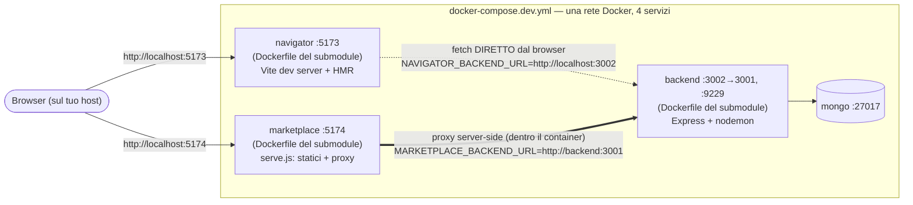
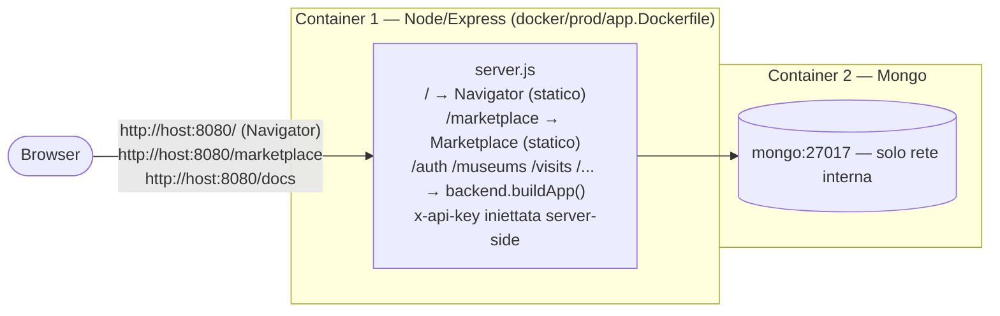

# artaround

Repo di orchestrazione del progetto **ArtAround** (Tecnologie Web, UniBO). Non
contiene logica applicativa propria (a parte un piccolo script di assembly per
la produzione, vedi sotto): il suo compito è tenere insieme i tre componenti,
ciascuno un repo Git **autonomo** collegato come submodule, e fornire la
dockerizzazione — sia per lo sviluppo che per il deploy finale sui due
container del dipartimento.

## I tre componenti (submodule)

| Cartella | Repo Git | Cosa fa | Stack |
|---|---|---|---|
| `services/backend` | `artaround-backend` | API (auth API key + JWT, RBAC, multi-tenant) | Node.js + Express + MongoDB |
| `services/marketplace` | `artaround-marketplace` | App admin/curatore (musei, opere, visite) | Vanilla JS + HTML + CSS, Tailwind via CDN |
| `services/navigator` | `artaround-navigator` | App del visitatore (visita guidata, player, mappa) | React 19 + TypeScript + TanStack Router + Vite |

Ognuno è un progetto **completamente autonomo**: ha il proprio `app/` (codice
sorgente), il proprio `docker/` (Dockerfile + compose di sviluppo e
produzione standalone) e un proprio README esaustivo. Questo repo li
**consuma** com'è, senza duplicarne il codice — vedi "Come si intrecciano i
submodule" più sotto.

```
artaround/
├── app/                        # ESCLUSIVO di questo repo: script di assembly per la produzione
│   ├── package.json             # unica dipendenza: express
│   └── server.js                # monta backend + serve i due frontend + inietta x-api-key
├── docker/
│   ├── prod/
│   │   └── app.Dockerfile       # multi-stage: build Navigator + assembla backend + Marketplace
│   └── README.md                 # dettagli implementativi dell'immagine assemblata
├── docker-compose.dev.yml       # orchestra i 4 servizi di sviluppo (riusa il Dockerfile di ciascun submodule)
├── docker-compose.prod.yml      # i 2 container del dipartimento: app (assemblato) + mongo
├── .dockerignore
├── .gitignore
├── .gitmodules
├── docs/                         # specifiche del docente, architettura, knowledge base
├── services/
│   ├── backend/                  # submodule artaround-backend (app/, tests/, docker/, README.md)
│   ├── marketplace/               # submodule artaround-marketplace (app/, tests/, docker/, README.md)
│   └── navigator/                  # submodule artaround-navigator (app/, docker/, README.md)
└── README.md                     # questo file
```

Nessun `.env.example` committato, per lo stesso motivo già documentato nei tre
submodule: l'esecuzione è **sempre e solo via Docker**. `docker-compose.dev.yml`
porta già i default di sviluppo scritti nel file stesso (`${VAR:-default}`);
`docker-compose.prod.yml` richiede i segreti obbligatori esportati nella shell
(o in un `.env` locale non versionato, letto automaticamente da Docker Compose
se presente accanto al file) — vedi "Variabili d'ambiente" più sotto.

## Primo avvio (clone + submodule)

```bash
git clone --recurse-submodules <url-di-artaround>
# oppure, se già clonato senza submodule:
git submodule update --init --recursive
```

---

## Come si intrecciano i submodule

Questo repo **non copia** il codice dei tre submodule: li referenzia come
cartelle Git a sé stanti (`services/<nome>`, ciascuna un checkout del proprio
repo a un commit preciso) e li usa in due modi diversi a seconda dell'ambiente:

- **In sviluppo**, `docker-compose.dev.yml` builda ciascun servizio dal
  **Dockerfile di sviluppo che il submodule stesso possiede**
  (`services/<nome>/docker/Dockerfile`) — zero duplicazione. Il compose si
  limita a cablare rete, porte e variabili tra i quattro servizi.
- **In produzione**, `docker/prod/app.Dockerfile` (di questo repo) **assembla**
  i build dei tre submodule in un solo container Node/Express, secondo il
  vincolo di consegna (vedi sotto). Qui sì c'è del codice proprio di questo
  repo — `app/server.js` — perché la composizione non è responsabilità di
  nessuno dei tre singolarmente.

### Il vincolo che guida la produzione

`docs/knowledge-base.md` è netto: *"Deploy obbligatorio su due container
Docker delle macchine del dipartimento — nessuna eccezione [...] in un docker
c'è node/express/etc.; nell'altro c'è mongo e basta"*. `docs/ARCHITECTURE.md`
aggiunge che la build statica del Navigator va *"servita da Nginx o
equivalente"*. Non essendoci spazio per un terzo container Nginx,
**l'equivalente è lo stesso processo Node** che espone anche le API — da qui
`app/server.js`.

---

## Topologia di SVILUPPO



**L'asimmetria da non sbagliare mai**, ripetuta anche nei commenti di
`docker-compose.dev.yml`: il Navigator è una SPA il cui JavaScript gira **nel
browser**, quindi il suo `BACKEND_URL` dev'essere una porta **pubblicata
sull'host** (`http://localhost:3002`) — il browser non può risolvere il nome
di un servizio Docker. Il Marketplace invece fa da proxy **dentro il proprio
container** (`serve.js`), quindi il suo `BACKEND_URL` è correttamente il nome
del servizio sulla rete Docker (`http://backend:3001`). Scambiarli rompe
silenziosamente l'uno o l'altro.

### Avvio

```bash
# 1) database + backend (nessun .env da preparare: i default di sviluppo
#    sono già scritti in docker-compose.dev.yml)
docker compose -f docker-compose.dev.yml up -d --build mongo backend

# 2) seed -> stampa la API key di bootstrap
docker compose -f docker-compose.dev.yml run --rm backend npm run seed

# 3) frontend — passa la chiave stampata al comando (o esportala nella shell)
API_KEY=<chiave-stampata> docker compose -f docker-compose.dev.yml up -d --build
```

- Navigator → <http://localhost:5173>
- Marketplace → <http://localhost:5174>
- Backend / Swagger → <http://localhost:3002/docs> (Basic Auth `swagger`/`swagger`)

Account demo (password `12345678`): `admin` (super_admin), `autore1`/`autore2`
(author), `visitatore1`/`visitatore2` (visitor — solo Navigator).

---

## Topologia di PRODUZIONE (2 container)



Singola origine: né il Navigator né il Marketplace vedono mai la API key nel
browser (a differenza delle rispettive modalità *standalone*, dove — per chi
le esegue da sole senza questo repo — la chiave può essere necessaria lato
client: vedi il README di ciascun submodule).

### Deploy locale / staging

```bash
git submodule update --init --recursive

# segreti obbligatori: esportali nella shell (o mettili in un .env locale
# NON versionato, accanto a questo file — Docker Compose lo legge da solo)
export MONGO_PASSWORD=... JWT_SECRET=... SWAGGER_PASSWORD=...

docker compose -f docker-compose.prod.yml build
docker compose -f docker-compose.prod.yml up -d mongo

# seed una tantum -> stampa la API key
docker compose -f docker-compose.prod.yml run --rm app npm run seed
export APP_API_KEY=<chiave-stampata>

docker compose -f docker-compose.prod.yml up -d
```

Verifica: <http://localhost:8080> (Navigator), `/marketplace`, `/health`, `/docs`.

### Deploy sui container del dipartimento

Vedi [`docker/README.md`](docker/README.md) per il dettaglio del layout
dentro l'immagine e le istruzioni per sostituire le immagini base con quelle
fornite dai tecnici (obbligatorie, nessuna immagine custom ammessa).

Alla consegna: aggiorna nel `README.txt` del progetto i campi `URI del
marketplace` e `URI del navigator` con gli URL pubblici assegnati.

---

## Mappa delle porte

| Ambiente | Servizio | Host | Container | Note |
|---|---|---|---|---|
| Dev | Backend / Swagger | `3002` | `3001` | host 3002 evita il conflitto con Docker Desktop su :3001 |
| Dev | Debugger Node | `9229` | `9229` | |
| Dev | Navigator (Vite) | `5173` | `5173` | HMR |
| Dev | Marketplace (`serve.js`) | `5174` | `5174` | proxy + iniezione x-api-key |
| Dev | MongoDB | `27017` | `27017` | |
| Prod | App (tutto) | `${APP_PORT:-8080}` | `3001` | Navigator `/`, Marketplace `/marketplace`, API `/…`, docs `/docs` |
| Prod | MongoDB | — | `27017` | solo rete interna, non pubblicata |

## Variabili d'ambiente

Nessun file da copiare: in sviluppo i default bastano già; in produzione le
variabili senza default (**obbligatorie**) vanno esportate nella shell (o in
un `.env` locale non versionato) prima dei comandi `docker compose`.

| Variabile | Dove | Sviluppo (default) | Produzione |
|---|---|---|---|
| `MONGO_USER` / `MONGO_PASSWORD` / `MONGO_DB` | entrambi | `artaround` / `artaround` / `artaround` | `MONGO_PASSWORD` **obbligatoria** |
| `JWT_SECRET` | entrambi | `dev-jwt-secret-change-me` | **obbligatoria** |
| `SWAGGER_USER` / `SWAGGER_PASSWORD` | entrambi | `swagger` / `swagger` | `SWAGGER_PASSWORD` **obbligatoria** |
| `API_KEY` | solo dev | vuota finché non fai il seed | — |
| `NAVIGATOR_BACKEND_URL` | solo dev | `http://localhost:3002` (porta host, letta dal browser) | — |
| `MARKETPLACE_BACKEND_URL` | solo dev | `http://backend:3001` (rete Docker, server-side) | — |
| `APP_API_KEY` | solo prod | — | **obbligatoria** (vuota = 401 su tutte le API) |
| `NAVIGATOR_API_BASE_URL` | solo prod | — | fissa a `""` (same-origin, non modificarla) |
| `APP_PORT` | solo prod | — | `8080` |
| `MUSEUM_SLUG` | entrambi | `galleria-degli-uffizi` | `galleria-degli-uffizi` |

## Ciclo di vita di un submodule

```bash
# lavorare su un componente (es. backend)
cd services/backend
git checkout main && git pull
# ... modifiche, commit, push sul repo artaround-backend ...

# tornare al repo Main e aggiornare il puntatore al nuovo commit
cd ../..
git add services/backend
git commit -m "bump artaround-backend"
```

Ogni submodule ha il proprio README con le istruzioni di sviluppo/test/deploy
**standalone** (senza questo repo): [`services/backend/README.md`](services/backend/README.md),
[`services/marketplace/README.md`](services/marketplace/README.md),
[`services/navigator/README.md`](services/navigator/README.md).

## Documentazione di progetto

`docs/` contiene le specifiche del docente riassunte, l'architettura
(`ARCHITECTURE.md`, `architecture.puml`), la knowledge base e le FAQ del
corso — riferimento per i vincoli (stack ammessi, deploy, criteri di
valutazione) citati in questo README.

## Troubleshooting

| Sintomo | Causa probabile | Rimedio |
|---|---|---|
| `services/backend` (o gli altri) vuoto, build fallisce | submodule non inizializzati | `git submodule update --init --recursive` |
| Navigator: `Failed to fetch` / errore di rete al login | `NAVIGATOR_BACKEND_URL` punta a un nome di servizio Docker invece che a `localhost` | deve restare una porta pubblicata sull'host, mai `http://backend:...` |
| Marketplace: `Backend non raggiungibile` | `MARKETPLACE_BACKEND_URL` errato o backend non healthy | verifica che punti a `http://backend:3001` (nome servizio) e che il backend sia partito |
| Login fallisce con `Invalid API key` | `API_KEY`/`APP_API_KEY` mancante o vecchia | ri-esegui il seed, aggiorna la env, riavvia |
| Navigator/Marketplace: 401 dopo il login (prod) | `APP_API_KEY` non impostata | impostala in `.env.prod` e riavvia `app` |
| Porta 3001 occupata (Windows) | Docker Desktop la usa | in dev il backend è pubblicato su **3002** |
| `docker compose config` dà errore di variabile mancante | in prod manca un segreto obbligatorio nella shell (o nel `.env` locale) | esporta `MONGO_PASSWORD`, `JWT_SECRET`, `SWAGGER_PASSWORD` prima del comando |
